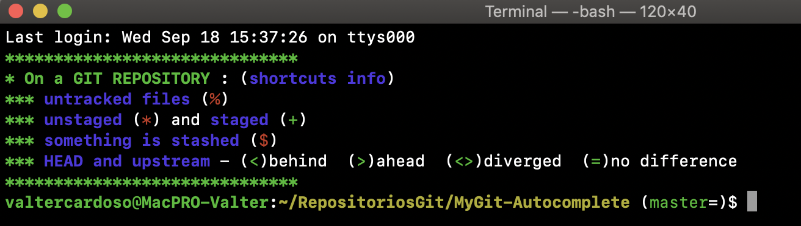

# MyGit - Autocomplete and Info

This work was for fun, when i was tired to do all the times `git branch` and `git status`, just to know what was untracked, modified, etc, or even to know if i had some work stashed (real problems can happen if you forget your stashed work :grimacing: ...).

### Features
- Show the name of the working branch
- Identifies:
    - untracked `%`
    - unstaged `*`
    - staged `+`
    - stashed `$`
    - Difference between HEAD and its upstream
        - `<` indicates you are behind
        - `>`indicates you are ahead
        - `<>` indicates you have diverged
        - `=` indicates that there is no difference
- Some colour in the *prompt* of iOS terminal
- `ls` command shows colours for different types of files and folders

### Notes (more like added info!)
- Only loads the git identifiers when you open the terminal in a Git repository (no need to overcharge bash when not!), but colour in the *prompt* of iOS terminal loads everytime
- Tested in ***Linux Ubuntu*** and ***iOS Mojave***

### Installation
- ***iOS install:***
    - Go to your `HOME` folder `(~/)`, and then:
        - copy there the `git_plugins` folder
        - *copy* and *paste* the code in the `iOS_bash.bash_profile` to your `.bash_profile` file (*if you do not have it, create one*), or other bash profile you use

- ***Linux install:***
    - Go to your `HOME` folder `(~/)`, and then:
        - copy there the `git_plugins` folder
        - *copy* and *paste* the code in the `linux_bash.bashrc` to your `.bashrc` file (*if you do not have it, create one*), or other bash profile you use

### Thanks and Credits
The fun of this work was made possible by:
- [Git Documentation](https://git-scm.com/doc) in the [Git](https://git-scm.com) Homepage
- The book [Git Pro](https://git-scm.com/book/en/v2)
- Git *web interface* in [GitHub](https://github.com/git/git) (home of the files `git-completition.bash` and `git-prompt.sh`)

Links of information files used:

- Git Pro [ [pdf](https://github.com/progit/progit2/releases/download/2.1.164/progit.pdf) | [epub](https://github.com/progit/progit2/releases/download/2.1.164/progit.epub) | [mobi](https://github.com/progit/progit2/releases/download/2.1.164/progit.mobi) ]
- GitHub Cheat Sheet [ [pdf](https://github.github.com/training-kit/downloads/github-git-cheat-sheet.pdf) ]
- Visual Git Cheat Sheet [ [page link](http://ndpsoftware.com/git-cheatsheet.html) ]
